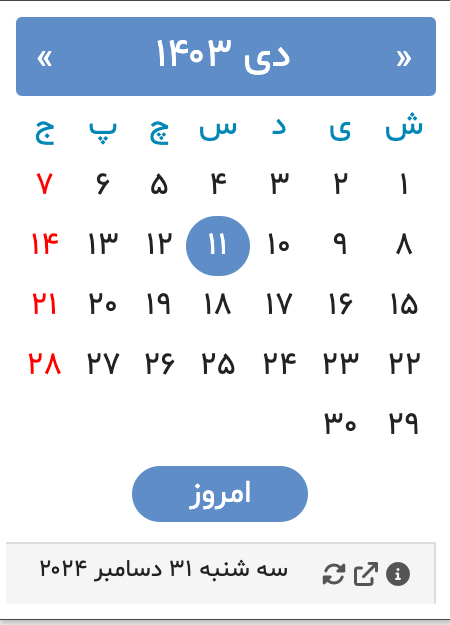
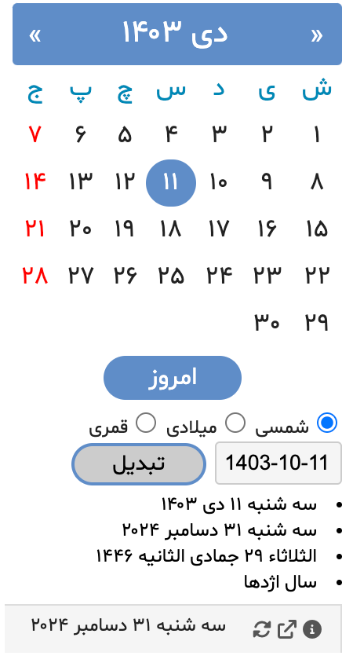
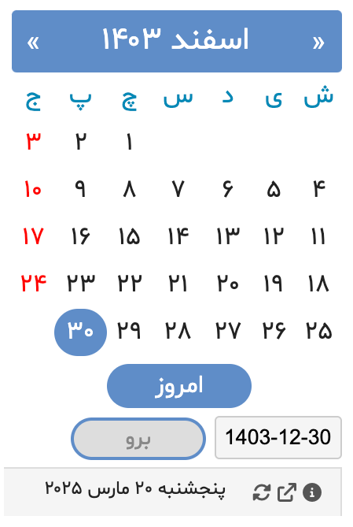
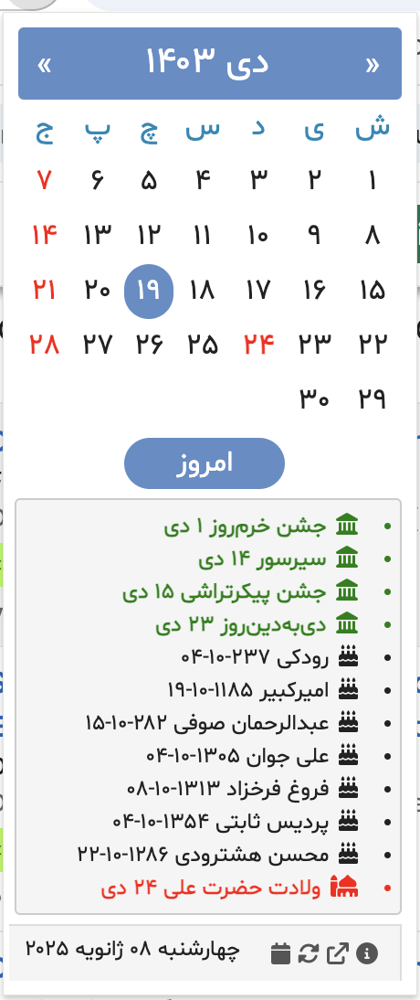

# افزونه تقویم هجری خورشیدی برای کروم

> برای مشاهده مستندات به زبان انگلیسی، به [صفحه English README](readme.md) مراجعه کنید.

یک افزونه ساده مبتنی بر جاوااسکریپت برای مرورگرهای Chrome و Edge که امکان استفاده از تقویم جلالی (شمسی) و تبدیل تاریخ، نمایش تاریخ دلخواه و فهرست تعطیلات، مناسبت‌های ملی، مشاهیر ایرانی و مناسبت‌های باستانی را فراهم می‌کند.

**نسخه:** ۳.۸۹  
**آخرین بروزرسانی:** ۲۲ اسفند ۱۴۰۳

## امکانات

- **نمای ماهانه**: نمایش ماه جاری جلالی با معادل میلادی در هنگام حرکت ماوس روی تاریخ‌ها
- **ناوبری**: حرکت آسان بین ماه‌ها با دکمه‌های قبل/بعد
- **تبدیل چند تقویمی**: تبدیل تاریخ بین:
  - تقویم جلالی (شمسی)
  - تقویم میلادی
  - تقویم قمری
- **اطلاعات تکمیلی**:
  - نماد سال چینی برای سال انتخاب شده
  - محاسبه فاصله روزها برای تاریخ‌های گذشته یا آینده
- **چند زبانه**: در دسترس به زبان‌های فارسی، انگلیسی، آلمانی، فرانسوی، نروژی، سوئدی، روسی، ترکی، ایتالیایی، عربی و اسپانیایی که در بخش گزینه‌ها قابل تنظیم است.
- **محدوده تاریخ**: پشتیبانی از سال‌های ۱۲۰۰ تا ۱۵۰۰ شمسی

## راهنمای استفاده

- استفاده از دکمه‌های بالا سمت چپ و راست برای حرکت بین ماه‌ها
- کلیک روی دکمه "امروز" برای بازگشت به تاریخ جاری
- حرکت ماوس روی تاریخ‌ها برای مشاهده معادل میلادی

### تبدیل تقویم

انتخاب هر تاریخ در یک سیستم تقویمی برای مشاهده معادل آن در:

- تقویم جلالی
- تقویم میلادی
- تقویم قمری

## نصب

- برای نصب در مرورگرهای Chrome یا Edge به سایت [Chrome Web Store](https://chromewebstore.google.com/detail/persian-jalali-calendar/baacdjbfffggbkmodigllhihmfnaiehf?authuser=0&hl=fa-IR) مراجعه کنید.

## تاریخچه

اولین انتشار در مهر ماه ۱۳۸۵، این افزونه بیش از ۱۸ سال است که به کاربران در استفاده از تقویم شمسی کمک می‌کند.

## گالری

|  |
|:--:|
| تقویم نمای ماهیانه |

|  |
|:--:|
| تبدیل تاریخ |

|  |
|:--:|
| برو به تاریخ |

|  |
|:--:|
| مناسبت‌ها |

## بازخورد و تماس

برای ارسال بازخورد یا گزارش مشکلات، لطفاً به [صفحه مشکلات در گیت‌هاب](https://github.com/simorgh1/persian-calendar-chrome-extension-doc/issues) مراجعه کنید.
