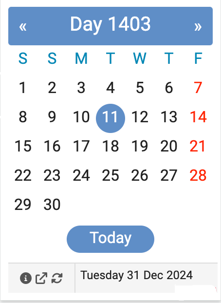
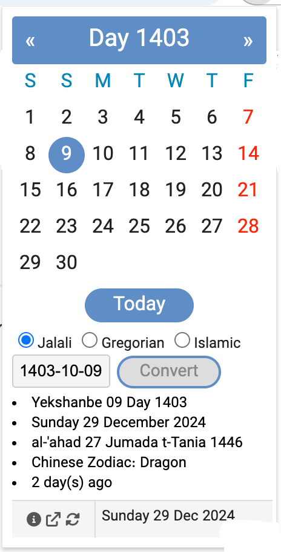
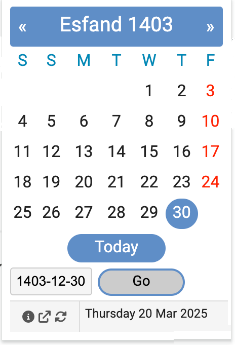
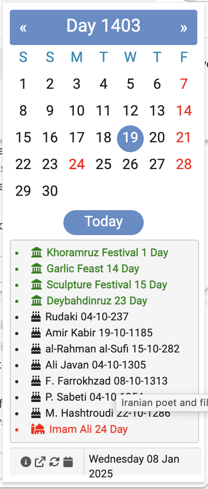

# Persian Jalali Calendar Chrome Extension

> For documentation in Persian, see the [Persian README](readme-fa.md)

## Introduction

A simple JavaScript-based Chrome/Edge extension that provides a Jalali (Persian) Calendar with conversion capabilities, rendering specific dates and listing events such as holidays, Iranian historic figures, and ancient Persian festivals.

**Version:** 3.89  
**Last update:** 12-03-2025

## Features

- **Month View**: Shows current Jalali month
- **Navigation**: Easy navigation between months with next/previous buttons
- **Multi-Calendar Conversion**: Convert dates between:
- Jalali (Persian) Calendar
- Gregorian Calendar
- Islamic Calendar
- **Additional Information**:
- Chinese zodiac for the selected years
- Days difference calculation for past/future dates
- **Localization**: Available in English, French, German, Italian, Norwegian, Persian, Russian, Spanish, Swedish, Arabic, and Turkish, which can be configured in the Options.
- **Date Range**: Supports Jalali years from 1200 to 1500

## Usage

- Use left/right top buttons to navigate between months
- Click "Today" to return to current date
- Hover over dates to see Gregorian equivalents

### Calendar Conversion

Select any date in one calendar system to see its equivalent in:

- Jalali Calendar
- Gregorian Calendar
- Islamic Calendar

## Installation

- Install for Chrome or Edge from the [Chrome Web Store](https://chromewebstore.google.com/detail/persian-jalali-calendar/baacdjbfffggbkmodigllhihmfnaiehf?authuser=0&hl=en-GB)

## History

First released in October 2006, this extension has been helping users with Persian calendar needs for over 18 years.

## Media

|  |
|:--:|
| Calendar month view |

|  |
|:--:|
| Convert date |

|  |
|:--:|
| Go to date |

|  |
|:--:|
| Events |

## Feedback and Contact

Your feedback is valuable! Please visit: [GitHub Issues](https://github.com/simorgh1/persian-calendar-chrome-extension-doc/issues)
